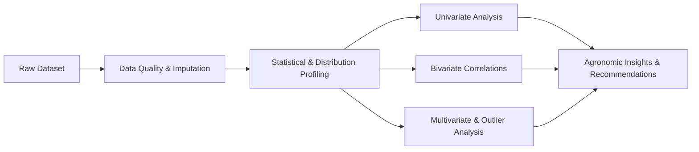

# 🌾 Seasonal Agriculture Performance Analysis

[](https://www.python.org/)
[](https://pandas.pydata.org/)
[](https://numpy.org/)
[](https://seaborn.pydata.org/)
[](https://matplotlib.org/)
[](https://jupyter.org/)
[](https://opensource.org/licenses/MIT)

> **A comprehensive exploratory data analysis (EDA) and statistical investigation into seasonal agricultural productivity, resource efficiency, and farm economics across Indian farming regions.**

---

## 📌 Executive Summary

Agricultural productivity and farm profitability are governed by seasonal variations in climatic conditions, irrigation access, soil health, and market economics. This project conducts an end-to-end data analytics study on farm-level records across India across three primary agricultural seasons: **Kharif**, **Rabi**, and **Zaid**.

By examining **4,000 farm records** spanning **8 major agricultural states**, **8 crop varieties**, and **28 distinct environmental, operational, and financial parameters**, this study isolates the drivers of high crop yields, economic profitability, and water-use efficiency.

---

## 🎯 Key Objectives

1. **Seasonal Productivity Assessment:** Quantify how crop yield (tonnes/ha) and total production vary across Kharif, Rabi, and Zaid seasons.
2. **Climate & Environmental Correlation:** Analyze the impact of rainfall, temperature, relative humidity, sunlight hours, and soil chemistry (pH, NPK levels) on seasonal outcomes.
3. **Irrigation & Water Optimization:** Compare irrigation techniques (**Drip, Sprinkler, Flood, Rainfed**) in terms of water consumption ($m^3$) and water efficiency.
4. **Economic Viability & Profitability:** Trace input expenditure (fertilizers, pesticides, operations) against gross revenue and net profit (INR) to identify high-margin versus loss-prone crop-season pairings.
5. **Data Quality & Rigor:** Perform statistical data cleaning, distribution checks, missing value imputations, and IQR-based outlier diagnostics without compromising real-world agricultural variance.

---

## 📂 Repository Structure

```plaintext
Seasonal-Agriculture-Performance-Analysis/
├── Certificate.pdf                                                     # Course / Project Completion Certificate
├── Major Project_Seasonal Agriculture Performance Analysis..pdf        # Full technical project report & documentation
├── Seasonal_Agriculture_Performance_Analysis.ipynb                     # Complete Jupyter Notebook (EDA, code, plots & insights)
├── Seasonal_Agriculture_Performance_Analysis_Major_Project_Presentation.pptx # Project presentation slide deck
├── seasonal_agriculture_performance_dataset.csv                       # Farm-level dataset (4,000 records × 28 features)
└── README.md                                                           # Project documentation
```

---

## 📊 Dataset & Feature Dictionary

The dataset encompasses **4,000 farm records** with **28 features** categorized as follows:

| Category | Features | Description |
| :--- | :--- | :--- |
| **Identifiers & Geography** | `Farm_ID`, `State`, `District` | Unique farm identifier, 8 states (*Andhra Pradesh, Maharashtra, Punjab, Telangana, Karnataka, Madhya Pradesh, Tamil Nadu, Gujarat*), and respective districts. |
| **Crop & Season** | `Crop`, `Season`, `Farm_Area_Hectares` | Crops (*Rice, Wheat, Maize, Pulses, Cotton, Groundnut, Chilli, Sugarcane*), agricultural seasons (*Kharif, Rabi, Zaid*), and landholding size. |
| **Environmental Parameters** | `Rainfall_mm`, `Avg_Temperature_C`, `Humidity_pct`, `Sunlight_Hours_Day` | Climatic variables influencing crop growth cycles. |
| **Soil Characteristics** | `Soil_pH`, `Soil_Moisture_pct`, `Nitrogen_kg_ha`, `Phosphorus_kg_ha`, `Potassium_kg_ha` | Physical and chemical soil parameters (NPK levels in kg/ha). |
| **Inputs & Operations** | `Irrigation_Method`, `Fertilizer_kg_ha`, `Pesticide_Litre_ha`, `Seed_Quality_Score` | Farming practices, seed vigor index, and agrochemical usage. |
| **Production Metrics** | `Yield_Tonnes_Ha`, `Production_Tonnes` | Output per hectare and gross harvest weight. |
| **Financial Metrics** | `Market_Price_INR_Tonne`, `Total_Cost_INR`, `Revenue_INR`, `Profit_INR` | Input cost vs. market realization and net profit/loss (INR). |
| **Resource Efficiency & Risk** | `Water_Used_m3`, `Water_Efficiency_t_per_1000m3`, `Disease_Pest_Risk_pct` | Total water consumption ($m^3$), production per thousand $m^3$, and disease/pest vulnerability score. |

---

## 🔬 Analytical Workflow & Methodology



### 1. Data Cleaning & Preprocessing
* **Missing Value Imputation:** Handled missing values systematically without default zero-filling (median imputation for skewed numerical features like rainfall, soil moisture, and yield; mode for categorical variables).
* **Deduplication:** Checked and validated that all 4,000 farm profiles represent unique observation instances.
* **Variable Classification:** Segmented features into identifiers, environmental factors, operational inputs, and performance outcomes.

### 2. Exploratory Data Analysis (EDA)
* **Univariate Analysis:** Analyzed frequency distributions of categorical features (crops, seasons, states, irrigation types) and histograms/KDE curves for key continuous variables (yield, rainfall, net profit).
* **Outlier Profiling (IQR):** Inspected extreme values in production and revenue. Differentiated true operational outliers from legitimate agro-economic realities (e.g., bumper harvests, high-value spice crops).
* **Bivariate Analysis:** 
  - Season vs. Yield & Net Profit
  - Rainfall vs. Yield elasticity
  - Irrigation technique vs. Water Efficiency ($t / 1,000 m^3$)
  - Farm area vs. Gross Production
* **Multivariate Analysis:** Evaluated interactions between seasons, crop choices, and irrigation methods using hue-stratified box plots and pair plots.

---

## 💡 Key Findings & Insights

* 🌦️ **Seasonal Performance Divergence:**
  - **Rabi Season:** Exhibits the most consistent and highest average yield (**~5.64 tonnes/ha**), facilitated by controlled temperature ranges and high daily sunlight hours.
  - **Kharif Season:** High rainfall sustains heavy monsoon staples (Rice, Maize, Cotton) and yields strong aggregate revenues, but elevated humidity spikes the **Disease & Pest Risk (~50%+)**.
  - **Zaid Season:** Characterized by elevated temperatures and reduced precipitation, requiring significantly higher irrigation volume (**>6,800 $m^3$ average**), leading to compressed margins when flood irrigation is deployed.

* 💧 **Irrigation Superiority (Drip vs. Flood):**
  - **Drip Irrigation** yielded the highest average output (**~6.65 tonnes/ha**) and superior water efficiency compared to traditional Flood Irrigation (**~4.65 tonnes/ha**), reducing water wastage by over 40%.

* 💰 **Crop Economics & Profit Margins:**
  - Cash and commercial crops such as **Chilli** and **Sugarcane** registered the highest net profitability per farm (>₹800,000 INR on average).
  - High-input grain crops (e.g., Rice, Wheat, Maize) showed susceptibility to negative net margins during seasons where fertilizer/irrigation input costs outpaced prevailing market realization prices.

---

## 🚀 How to Run Locally

### 1. Prerequisites
Ensure you have Python 3.8+ and `git` installed on your machine.

### 2. Clone the Repository
```bash
git clone https://github.com/PKhadarkhan/Seasonal-Agriculture-Performance-Analysis.git
cd Seasonal-Agriculture-Performance-Analysis
```

### 3. Create a Virtual Environment
```bash
# On Linux/macOS
python3 -m venv venv
source venv/bin/activate

# On Windows
python -m venv venv
venv\Scripts\activate
```

### 4. Install Dependencies
```bash
pip install pandas numpy matplotlib seaborn jupyter
```

### 5. Launch Jupyter Notebook
```bash
jupyter notebook Seasonal_Agriculture_Performance_Analysis.ipynb
```
*(Alternatively, you can upload `Seasonal_Agriculture_Performance_Analysis.ipynb` directly into [Google Colab](https://colab.research.google.com/)).*

---

## 🛠️ Technology Stack

* **Language:** Python
* **Data Processing & Manipulation:** [Pandas](https://pandas.pydata.org/), [NumPy](https://numpy.org/)
* **Data Visualization:** [Matplotlib](https://matplotlib.org/), [Seaborn](https://seaborn.pydata.org/)
* **Environment:** Jupyter Notebook / Google Colab
* **Documentation & Presentation:** Microsoft PowerPoint, Adobe PDF

---

## 📄 Deliverables & Artifacts

* 📓 **[Seasonal_Agriculture_Performance_Analysis.ipynb](Seasonal_Agriculture_Performance_Analysis.ipynb):** Clean, documented Python analytics notebook containing all statistical computations and Seaborn visualizations.
* 📑 **[Major Project Report (PDF)](Major%20Project_Seasonal%20Agriculture%20Performance%20Analysis..pdf):** In-depth technical documentation covering problem formulation, methodology, and domain recommendations.
* 📊 **[Project Presentation (PPTX)](Seasonal_Agriculture_Performance_Analysis_Major_Project_Presentation.pptx):** Summary slide deck for executive and academic presentation.
* 📜 **[Certificate (PDF)](Certificate.pdf):** Verification of project completion.

---

## 👤 Author

**P. Khadarkhan**
* **GitHub:** [@PKhadarkhan](https://github.com/PKhadarkhan)
* **Project:** Major Data Analytics Project — *Seasonal Agriculture Performance Analysis*

---

## 📝 License

This project is licensed under the [MIT License](LICENSE).
